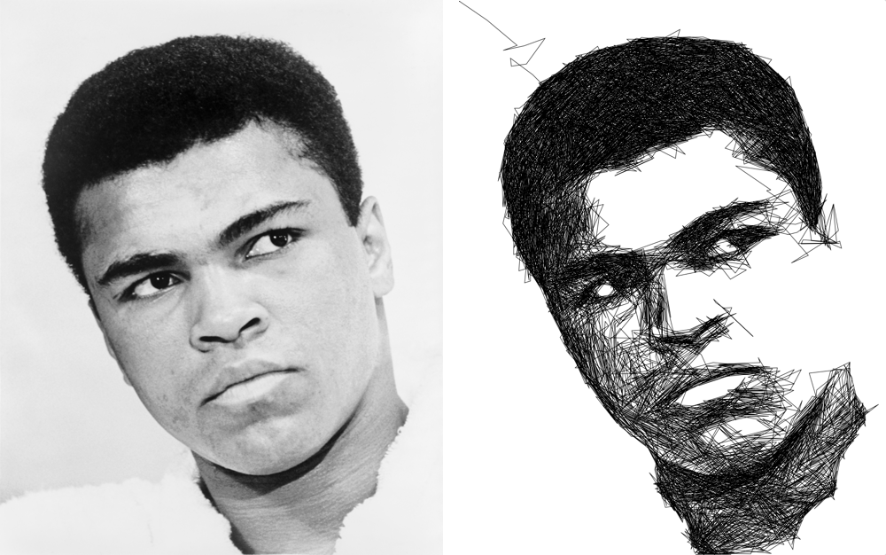
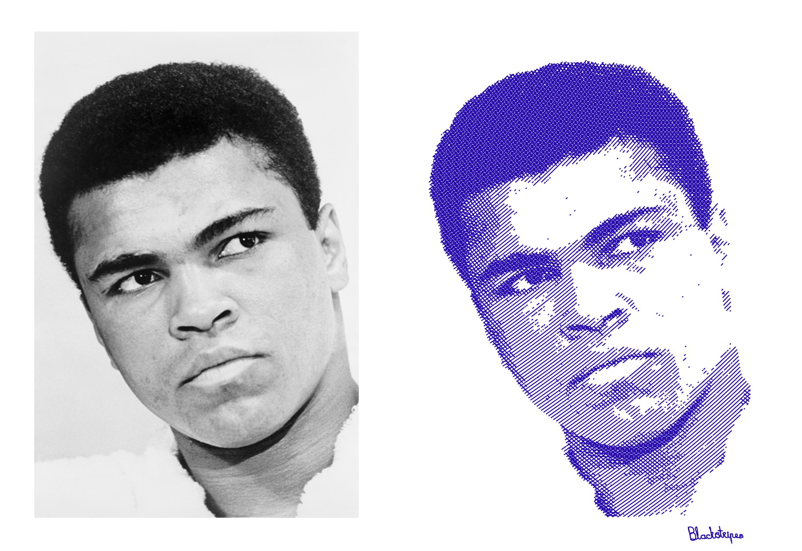
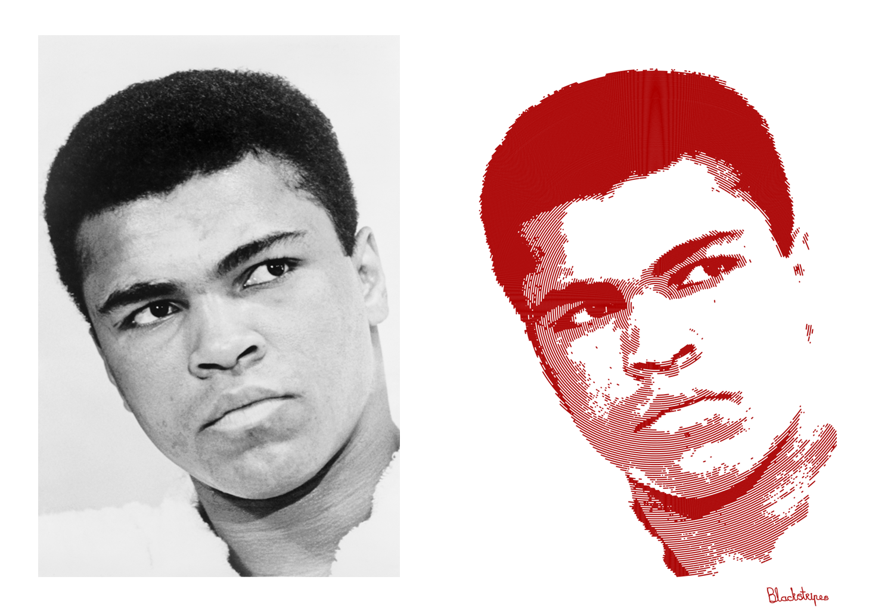

#Blackstripes python extensions
###Your drawbot will like it!

This is a python module written in c. It turns an png image into a svg line drawing. The output is very suitable for vsg capable drawbots. We use it every day on [blackstripes.nl](http://www.blackstripes.nl).

##How to use

This module exposes 3 drawing styles.

###1. Sketchy

	from blackstripes import sketchy

	sketchy.draw("ali.png",                 # input
             	 "ali_sketchy.svg",         # output
                1,                          # nibsize (line size in output svg)
                100,                        # max line length
                "#000000",                  # line color
                0.32,                       # scaling factor
                1,                          # line size (internal line size for calculations)
                540, 1021, 0.7              # signature transform tx, ty, scale
            )
            

######How does it work

1. Calculate the brightness of the inpute image.
2. Place the pen at pixel 0,0.
3. Get a random line length between 10 and the max segment length.
4. Evaluate 360 lines by making a 360 degree sweep with the selected line length.
5. Get the line covering the largest average darkness in the input image.
6. Draw this line white in the input image.
7. Draw this line black in the ouput image.
8. Calculate the brightness of the output image.
9. Repeat from step 2 until the brightness of the output image is equal to the inpute image.

###2. Crossed

	from blackstripes import crossed

	crossed.draw("ali.png",             # input
            	 "ali_crossed.svg",     # output
                2.0,                    # nibsize (line size in output svg)
                "#2200aa",              # line color
                0.32,                   # scaling factor
                200, 146, 110, 56,      # levels
                2,                      # type
                540,1021,0.7            # signature transform
            )
            

###2. Spiral

	from blackstripes import spiral

	spiral.draw("ali.png",                  # input
           	    "ali_spiral.svg",           # output
                2.0 ,                       # nibsize (line size in output svg)
                "#aa0000",                  # line color
                0.32,                       # scaling factor
                180, 108, 180, 108,         # levels
                2,                          # linespacing
                540,1021,0.7                # signature transform
            )
            

	
##How to build

(This module is tested with python 2.7 and python 3.4 on mac-osx and linux, but it will probably work on most platforms.)

1. Clone this repo
2. navigate to the src folder
3. `python setup.py build`
4. `python setup.py install`
5. navigate to the test folder
6. `python sketchy-test.py`
7. `python crossed-test.py`
8. `python spiral-test.py`

 

